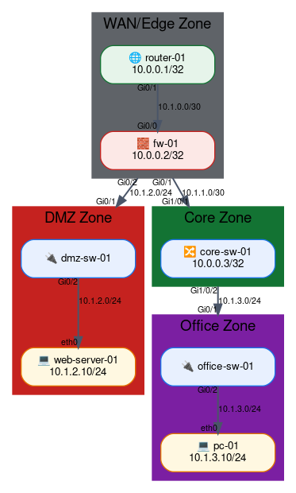
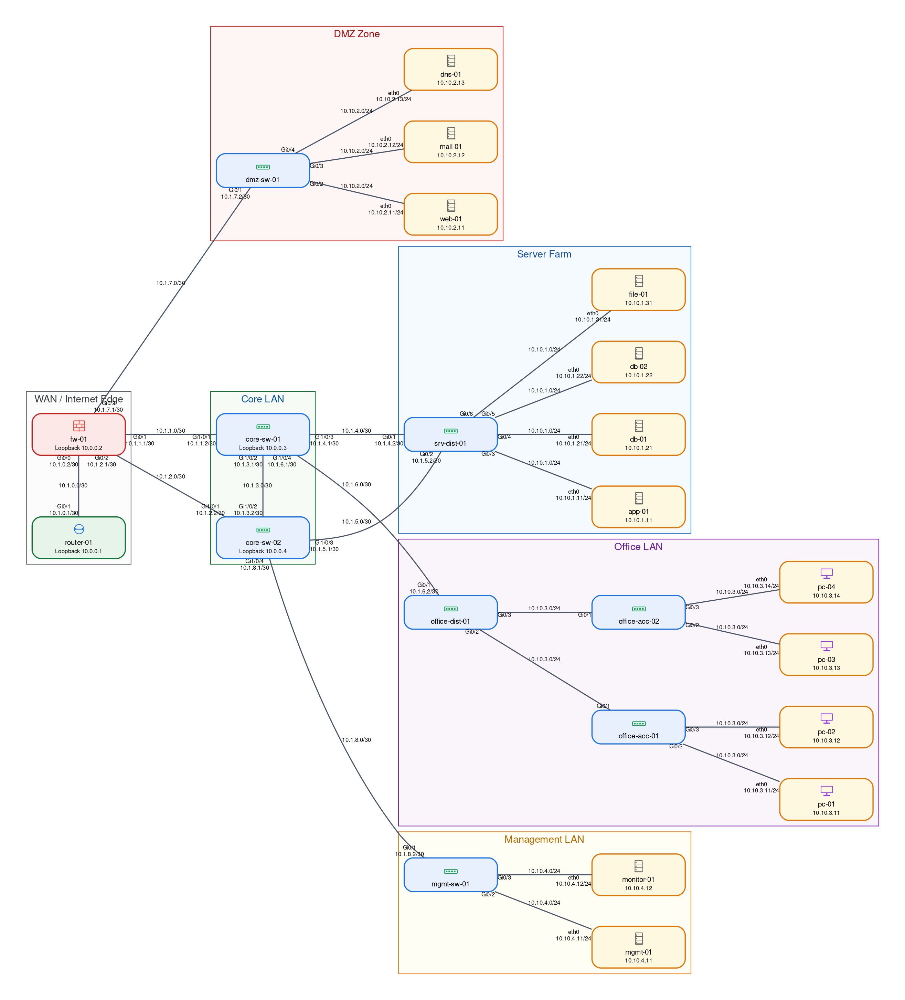
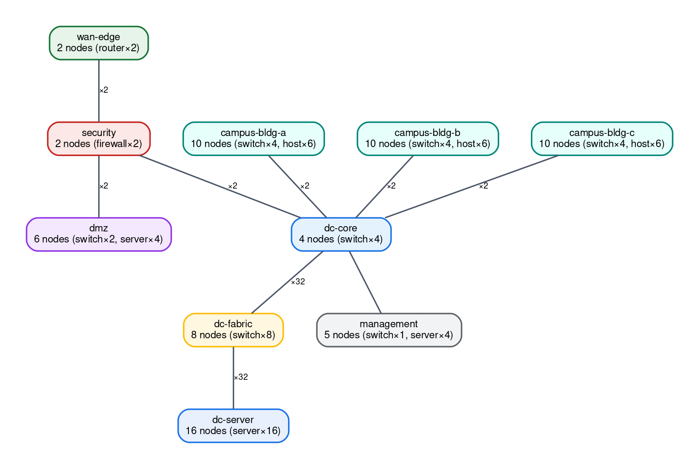
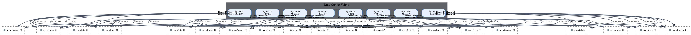
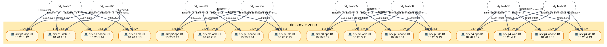
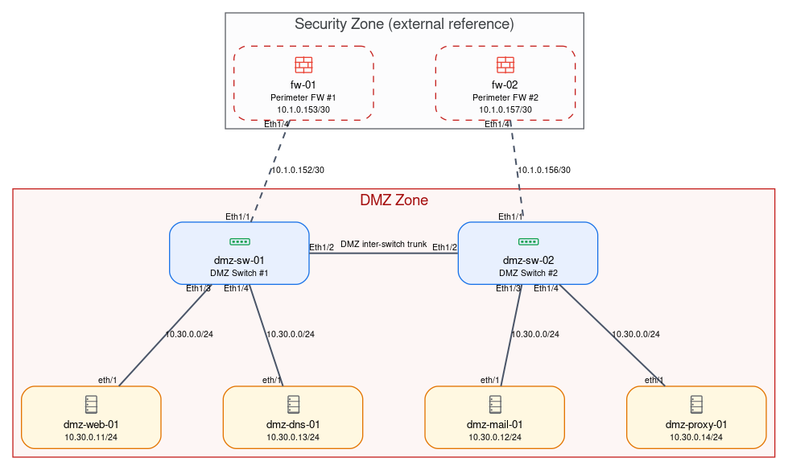
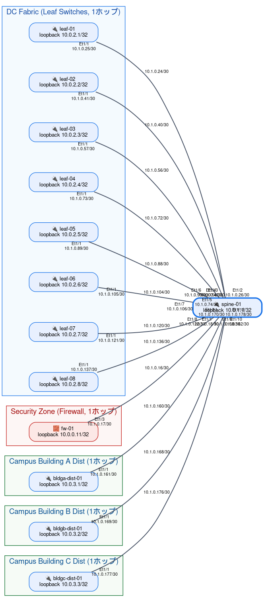
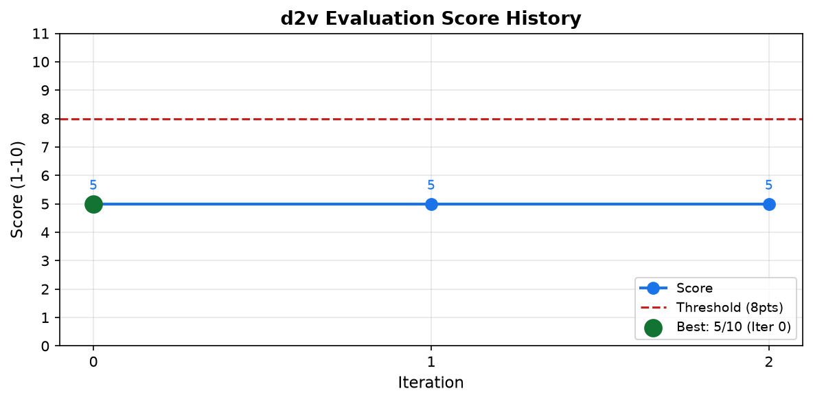

# d2v — Diagram to Vision

`iida-network-model` YANG YAML で記述したネットワークトポロジを、LLM (OpenAI / Azure OpenAI / Anthropic / Ollama) を通じて Graphviz の構成図（PNG / SVG）に自動変換するツールです。
生成した図を自動評価し、スコアが閾値に達するまで自律的に改善するループ構造を持ちます。

逆方向の **v2d（vision-to-diagram）** も同梱しており、構成図の**画像**から `iida-network-model` YAML を生成できます（[v2d のセクション](#v2d--画像からトポロジ-yaml-を生成vision-to-diagram)を参照）。

さらに、AI 支援でネットワーク設計を進めるための 2 つのツールを同梱しています。

- **validate（セマンティック検証 / design lint）**: スキーマ検証を超えて、宙ぶらりんリンク・重複・IP 整合・単一障害点（SPOF）・冗長性・ゾーンポリシーなど**設計そのものの妥当性**を検査します（[validate のセクション](#validate--セマンティック検証design-lint)）。
- **diff（意味的 diff ＋ 差分図）**: 2 つのトポロジ YAML の**構造差分**を検出し、追加/削除/変更を色分けした差分図を生成します。機器/リンク障害時の到達不能範囲（blast radius）も算出できます（[diff のセクション](#diff--トポロジの意味的-diff--差分図)）。

これらの検出・算出はすべて**決定論的（LLM 非依存・追加依存なし）**で、LLM は理由付けや要約の補助にのみ使います。

```
YAML (iida-network-model)
        │
        ▼
    parser.py        ← トポロジを構造化テキストに変換
        │
        ▼
  partitioner.py     ← 大規模時に zone 単位で俯瞰図＋詳細図に自動分割
        │
        ▼
   generator.py      ← LLM に DOT コードを生成させる
        │
        ▼
   evaluator.py      ← ルールベース + LLM で品質評価（1〜10点）
        │  score < threshold
        ▼
   improver (pipeline.py) ← LLM に改善させてループ
        │  score ≥ threshold or max_iter
        ▼
    renderer.py      ← DOT → PNG / SVG
        │
        ▼
   visualizer.py     ← スコア推移グラフ (score_history.png)
```

## 必要環境

| 項目 | バージョン |
|------|-----------|
| Python | 3.11 以上 |
| Graphviz (system) | 2.40 以上 |
| LLM API キー | OpenAI / Anthropic / Ollama のいずれか |

Graphviz のインストール（Ubuntu/Debian）：

```bash
sudo apt install graphviz
```

ノードのアイコンは d2v に**組み込みのデバイスアイコン画像**として同梱されており、絵文字フォントのインストールは不要です。図では、ノードのタイプ（`device-type`）ごとに以下のアイコンが自動で割り当てられます。

| ノードタイプ | `device-type` | アイコン |
|--------------|---------------|----------|
| ルータ | `router` | 双方向矢印付きの筐体（青） |
| スイッチ（L2/L3） | `switch` | ポート付きの筐体（緑） |
| ファイアウォール | `firewall` | レンガ壁（赤） |
| サーバ | `server` | ラック筐体（グレー） |
| PC端末 / ホスト | `host` | モニタ（紫） |
| ロードバランサ | `load-balancer` | 分散ツリー（橙） |
| 不明 | 上記以外 | 汎用ボックス（淡グレー） |

アイコンは PNG 出力ではラスタ画像として、SVG 出力ではベクター画像としてノードに埋め込まれます（SVG は外部ファイル参照を持たない自己完結形式）。アイコン画像は `src/d2v/assets/icons/` に配置され、`d2v.icons.write_assets()` で再生成できます。

## セットアップ

[uv](https://docs.astral.sh/uv/) を使うと、仮想環境の作成と依存インストールを一括で行えます。

```bash
# 1. リポジトリのクローン
git clone https://github.com/yourname/d2v.git
cd d2v

# 2. 依存をインストール（.venv を自動作成し uv.lock で固定）
uv sync                          # d2v 本体のみ
uv sync --extra web              # ブラウザ GUI も使う場合
uv sync --extra web --extra dev  # 開発（テスト）も行う場合

# 3. 環境変数ファイルの作成
cp .env.example .env
# .env を編集して API キーと LLM_PROVIDER を設定
```

インストール後は、次のいずれかでコマンドを実行します。

```bash
# 方法 A: 仮想環境を有効化（以降 python main.py … がそのまま使える）
source .venv/bin/activate
python main.py -i examples/sample_topology_small.yaml

# 方法 B: 有効化せず uv run で都度実行
uv run python main.py -i examples/sample_topology_small.yaml
```

> 本 README のコマンド例は `python main.py …` と記載しています。`uv sync` 後に
> `.venv` を有効化していない場合は、先頭に `uv run` を付けて実行してください。

<details>
<summary>uv を使わず pip でセットアップする場合</summary>

```bash
python -m venv .venv
source .venv/bin/activate
pip install -e .            # GUI も使うなら: pip install -e '.[web]'
```

</details>

### `.env` の設定例

```dotenv
# OpenAI を使う場合
LLM_PROVIDER=openai
OPENAI_API_KEY=sk-...
OPENAI_MODEL=gpt-4o

# Anthropic を使う場合
LLM_PROVIDER=anthropic
ANTHROPIC_API_KEY=sk-ant-...
ANTHROPIC_MODEL=claude-3-5-sonnet-20241022

# ローカル Ollama を使う場合
LLM_PROVIDER=ollama
OLLAMA_BASE_URL=http://localhost:11434
OLLAMA_MODEL=llama3.1:70b
```

## 使い方

```bash
python main.py --input examples/sample_topology_small.yaml
```

```
オプション:
  -i, --input TOPOLOGY_YAML   入力 YAML ファイルのパス（必須）
  -o, --output-dir DIR        出力ディレクトリ（デフォルト: output）
  -f, --format {png,svg}      出力フォーマット（デフォルト: png）
  -n, --max-iter N            最大イテレーション数（デフォルト: 3）
  -t, --threshold SCORE       合格スコア閾値 1〜10（デフォルト: 8）
  --split-threshold N         このノード数を超え、かつ zone 情報がある場合に
                              俯瞰図＋ゾーン詳細図へ自動分割（デフォルト: 40）
  --no-split                  自動分割を無効化し、常に 1 枚の図として生成する
  --focus DEVICE_ID           注目ノード（device-id）から --hops ホップ以内の
                              ノードだけを抜き出した集中図を 1 枚生成する
  --hops N                    --focus 指定時に何ホップ先まで含めるか
                              （1 または 2 を推奨。デフォルト: 1）
  --zone ZONE [ZONE ...]      指定したゾーンだけを描画対象にした図を 1 枚生成する
                              （複数指定でまとめて 1 枚。対象外ゾーンへの接続は
                              境界スタブとして表示）
  --zone-opacity 0.0-1.0      ゾーン（cluster）背景色の不透明度。背景が濃いときに
                              下げると淡くなる（1.0=不透明。デフォルト: 0.4）
```

### 大規模トポロジの自動分割（俯瞰図＋ゾーン詳細）

ノード数が `--split-threshold`（デフォルト 40）を超え、かつ各デバイスに `zone` が
設定されている場合、図を複数枚に自動分割します。

- **俯瞰図（overview）**: 各ゾーンを 1 つのまとまりに集約し、ゾーン間のリンクを
  本数付きで示す全体地図。
- **ゾーン詳細図**: ゾーンごとの内部詳細。他ゾーンへ跨る接続は「外部ゾーン参照
  ノード（境界スタブ）」として破線で描画され、各図が自己完結します。関連する
  L3 サブネットも自動抽出されます。

分割することで 1 枚あたりのノード数・トークン量が減り、可読性の向上と LLM の
レート制限（TPM）緩和の両方に効きます。しきい値以下、または `zone` 未設定の
トポロジは従来どおり 1 枚で生成されます。

```bash
# 大規模トポロジ（73 ノード）→ 俯瞰図＋ゾーン詳細に自動分割
python main.py -i examples/sample_topology_large.yaml

# 分割を無効化して 1 枚で生成
python main.py -i examples/sample_topology_large.yaml --no-split

# 分割しきい値を 20 ノードに引き下げ
python main.py -i examples/sample_topology_large.yaml --split-threshold 20
```

### 注目ノード集中図（1〜2 ホップ抽出）

`--focus` に注目したいノードの `device-id` を指定すると、そのノードを中心に
**物理接続を `--hops` ホップたどって到達できるノードだけ**を抜き出した部分構成図を
1 枚生成します（このとき自動分割は行われません）。大規模トポロジの中で特定機器の
周辺だけを素早く把握したいときに便利です。

- 注目ノードは図の中心に強調して配置され、ホップ数が大きいノードほど外側に描かれます。
- 各ノードには注目ノードからの距離（`N ホップ`）が注記されます。
- 抽出範囲の外へ続く接続を持つ境界ノードには「この先に N 台の接続あり（省略）」と
  注記され、図が全体の一部であることが分かります。
- 範囲内のノードに関連する L3 サブネットも自動抽出されます。
- **複数の注目ノードを指定**できます（例: `--focus spine-01 spine-02`）。この場合、
  いずれかの注目ノードから `--hops` ホップ以内に到達できるノードの**和集合**を
  1 枚のサブグラフとして抽出します。密接に関連する機器をまとめて中心に据えたいときに便利です。

```bash
# spine-01 から 1 ホップ以内（直接の隣接ノードのみ）
python main.py -i examples/sample_topology_large.yaml --focus spine-01

# spine-01 から 2 ホップ以内
python main.py -i examples/sample_topology_large.yaml --focus spine-01 --hops 2

# spine-01 と spine-02 の 2 台を中心に 1 ホップ以内（和集合）
python main.py -i examples/sample_topology_large.yaml --focus spine-01 spine-02
```

出力はサブディレクトリ `output/focus-<device-id>-<N>hop/` に生成され、ベスト画像は
`output/<stem>_focus-<device-id>-<N>hop.png` に集約されます。
複数指定時は device-id をハイフンで連結した名前になります
（例: `focus-spine-01-spine-02-1hop`）。

### 指定ゾーンだけを描画（ゾーン限定図）

`--zone` に描画したいゾーン名を指定すると、**そのゾーンに属するノードだけ**を
描画対象にした図を 1 枚生成します（このとき自動分割は行われません）。特定エリアの
内部構成だけを詳しく見たいときに便利です。

- 複数のゾーンを指定できます（例: `--zone dc-core dc-fabric`）。指定したゾーンを
  まとめて 1 枚に描画し、各ゾーンは背景色付きの cluster としてグルーピングされます。
- 対象外ゾーンへ跨る接続は「外部ゾーン参照ノード（境界スタブ）」として破線で
  描画され、図が自己完結します。多数の外部デバイスを持つゾーンは 1 ノードに集約されます。
- 対象ゾーンに関連する L3 サブネットも自動抽出されます。

```bash
# dc-fabric ゾーンだけを描画
python main.py -i examples/sample_topology_large.yaml --zone dc-fabric

# dc-core と dc-fabric をまとめて 1 枚に描画
python main.py -i examples/sample_topology_large.yaml --zone dc-core dc-fabric
```

出力はサブディレクトリ `output/zone-only-<zone>/` に生成され、ベスト画像は
`output/<stem>_zone-only-<zone>.png` に集約されます（複数指定時はゾーン名をハイフンで連結）。

> `--focus` と `--zone` は同時には指定できません。

### 実行例

```bash
# 小規模トポロジ（7 ノード）
python main.py -i examples/sample_topology_small.yaml

# 中規模トポロジ（23 ノード）、最大 5 回改善
python main.py -i examples/sample_topology_medium.yaml -n 5

# 大規模トポロジ（73 ノード）、zone 単位で自動分割
python main.py -i examples/sample_topology_large.yaml

# SVG で出力、閾値 9 点
python main.py -i examples/sample_topology_small.yaml -f svg -t 9
```

### 生成例（ギャラリー）

以下は上記コマンドで実際に生成した図です。矢印なしの物理リンク（ポート名・IP セグメント付き）、
淡いパステルのゾーン背景、バランスの取れた縦横比で描画されます。

#### 小規模トポロジ（7 ノード）

```bash
python main.py -i examples/sample_topology_small.yaml
```



#### 中規模トポロジ（23 ノード）

```bash
python main.py -i examples/sample_topology_medium.yaml -n 5
```



#### 大規模トポロジ（73 ノード・自動分割）

ノード数がしきい値を超えると、全体を俯瞰する **俯瞰図** と、ゾーンごとの **詳細図** に自動分割されます。

```bash
python main.py -i examples/sample_topology_large.yaml
```

**俯瞰図（ゾーン単位の全体地図）**



**ゾーン詳細図**

代表的なゾーンを 3 つピックアップして掲載します。

**DC Fabric（Leaf/Spine）** — 多数の外部接続をゾーン集約ノードにまとめ、`rankdir=LR` で縦積みに調整



**DC Server（サーバ群）**



**DMZ（公開サーバ領域）**



その他のゾーン詳細図:

| ゾーン | 図 |
|--------|-----|
| WAN Edge | [wan-edge](images/sample_topology_large_zone-wan-edge.png) |
| Security | [security](images/sample_topology_large_zone-security.png) |
| DC Core | [dc-core](images/sample_topology_large_zone-dc-core.png) |
| Campus 棟A / 棟B / 棟C | [bldg-a](images/sample_topology_large_zone-campus-bldg-a.png) / [bldg-b](images/sample_topology_large_zone-campus-bldg-b.png) / [bldg-c](images/sample_topology_large_zone-campus-bldg-c.png) |
| Management | [management](images/sample_topology_large_zone-management.png) |

多数の外部デバイスと接続するゾーン（DC Fabric など）は、他ゾーンへの境界を
「ゾーン集約ノード」にまとめ、横長になりすぎないよう `rankdir=LR` で縦積みに調整されます。

#### 注目ノード集中図（1 ホップ）

大規模トポロジの中から `spine-01` を中心に、直接つながるノードだけを抜き出した例です。

```bash
python main.py -i examples/sample_topology_large.yaml --focus spine-01
```



#### スコア推移

改善ループを 2 回以上行った場合、イテレーションごとのスコア推移グラフが出力されます。



### 出力ファイル

```
output/
├── iter_00/
│   ├── <stem>.dot          ← DOT ソースファイル
│   ├── <stem>.png          ← 生成画像
│   └── eval_iter00.json    ← 評価結果 JSON
├── iter_01/
│   └── ...
├── <stem>_best.png         ← 最高スコアの画像（コピー）
└── score_history.png       ← スコア推移グラフ（2 回以上の場合）
```

分割時（`--split-threshold` 超過）は、図ごとにサブディレクトリを作成し、
ベスト画像を出力ルートに集約します。

```
output/
├── overview/               ← 俯瞰図の iter_NN・評価結果
├── zone-<zone名>/          ← 各ゾーン詳細図の iter_NN・評価結果
│   └── ...
├── <stem>_overview.png     ← 俯瞰図（ベスト）
├── <stem>_zone-<zone名>.png ← 各ゾーン詳細図（ベスト）
└── ...
```

## トポロジ YAML の書き方

`iida-network-model` フォーマットに従って YAML を記述します。
YANG モデル定義: [`yang/iida-network-model.yang`](yang/iida-network-model.yang)

```yaml
network-model:
  physical-layer:
    device:
      - device-id: "router-01"
        device-name: "Internet Router"
        device-type: router        # router / switch / server / firewall / host / load-balancer
        zone: wan-edge             # subgraph cluster のゾーン名（任意）
        asn: 65000
        loopback: "10.0.0.1/32"
        interface:
          - interface-id: "GigabitEthernet0/1"
            description: "To Firewall"
            ip-address: "10.1.0.1/30"
      # ... 他のデバイス

    physical-connection:
      - connection-id: "link-01"
        endpoint:
          - device-id: "router-01"
            interface-id: "GigabitEthernet0/1"
          - device-id: "fw-01"
            interface-id: "GigabitEthernet0/0"
      # ... 他のリンク
```

サンプルファイル:
- [`examples/sample_topology_small.yaml`](examples/sample_topology_small.yaml) — 7 ノード / 4 ゾーン
- [`examples/sample_topology_medium.yaml`](examples/sample_topology_medium.yaml) — 23 ノード / 6 ゾーン
- [`examples/sample_topology_large.yaml`](examples/sample_topology_large.yaml) — 73 ノード / 10 ゾーン（自動分割の対象）

## プロジェクト構成

```
d2v/
├── main.py                        ← CLI エントリポイント
├── src/d2v/
│   ├── config.py                  ← pydantic-settings による設定管理
│   ├── parser.py                  ← YAML → 構造化テキスト（TopologyModel）
│   ├── partitioner.py             ← zone 単位の俯瞰図＋詳細図への自動分割
│   ├── generator.py               ← LLM → DOT コード生成
│   ├── renderer.py                ← DOT → PNG / SVG
│   ├── evaluator.py               ← 品質評価（ルールベース + LLM）
│   ├── pipeline.py                ← 生成→評価→改善ループ
│   ├── visualizer.py              ← スコア推移グラフ（matplotlib）
│   ├── progress.py                ← 進捗イベント定義（CLI/GUI 共通）
│   ├── validator.py               ← セマンティック検証（design lint）
│   ├── diff.py                    ← 意味的 diff・差分図・影響分析（blast radius）
│   ├── llm/                       ← LLM クライアント層
│   │   ├── __init__.py            ← get_llm() ファクトリ関数
│   │   ├── base.py                ← LLMClient 抽象基底クラス（vision 対応）
│   │   ├── openai_client.py
│   │   ├── azure_openai_client.py ← Azure OpenAI（api-key ヘッダー方式）
│   │   ├── anthropic_client.py
│   │   └── ollama_client.py
│   ├── web/                       ← ブラウザ GUI（FastAPI）
│   │   ├── app.py                 ← FastAPI アプリ・ルーティング
│   │   ├── service.py             ← d2v/v2d オーケストレーション（CLI と共通）
│   │   ├── jobs.py                ← 非同期ジョブ管理・SSE 進捗
│   │   ├── events.py              ← ジョブ状態・イベントのシリアライズ
│   │   └── static/                ← SPA（index.html / app.js / style.css）
│   └── v2d/                       ← vision-to-diagram（画像 → YAML）
│       ├── preprocess.py          ← 画像の正規化・データURL化
│       ├── schema.py              ← 中間表現（ExtractedDiagram）
│       ├── extractor.py           ← vision LLM で画像 → 中間表現
│       ├── refine.py              ← 抽出結果の整合性補正
│       ├── converter.py           ← 中間表現 → iida-network-model YAML
│       ├── evaluate.py            ← 抽出精度の計測・d2v 再描画
│       └── pipeline.py            ← 画像 → YAML の一連フロー
├── prompts/
│   ├── diagram-system.md          ← DOT 生成システムプロンプト
│   ├── diagram-system-overview.md ← 俯瞰図用の生成プロンプト
│   ├── diagram-evaluator.md       ← 評価プロンプト（10 点満点）
│   ├── diagram-evaluator-overview.md ← 俯瞰図用の評価プロンプト
│   ├── diagram-improver.md        ← 改善プロンプト
│   ├── v2d-extract.md             ← 画像 → 中間表現 抽出プロンプト
│   ├── design-lint.md             ← validate の理由・修正案（--explain）プロンプト
│   └── diagram-diff.md            ← diff の自然言語サマリ（--summarize）プロンプト
├── examples/
│   ├── sample_topology_small.yaml
│   ├── sample_topology_medium.yaml
│   ├── sample_topology_large.yaml
│   └── sample_policy.yaml         ← validate 用サンプルポリシー（企業 NW 向け）
├── tests/                         ← Web API・v2d の単体/回帰テスト（pytest）
└── yang/
    └── iida-network-model.yang    ← YANG モデル定義
```

## 評価基準

LLM は以下の観点で 10 点満点で評価します。ルールベースチェックでペナルティが加算されます。

| 観点 | 配点 |
|------|------|
| 完全性（ノード・リンクの欠落なし） | 3 点 |
| ラベル網羅性（taillabel / headlabel / IP） | 3 点 |
| ゾーン分類（subgraph cluster の適切な設定） | 2 点 |
| デザイン品質（視認性・線の交差最小化） | 2 点 |

## v2d — 画像からトポロジ YAML を生成（vision-to-diagram）

d2v の逆変換です。ネットワーク構成図の**画像（PNG / JPEG）**をマルチモーダル LLM で解析し、
`iida-network-model` YAML を生成します。出力は d2v の入力と同一スキーマなので、
**画像 → v2d → YAML → d2v → 図** の往復ループが可能です。

```
構成図画像 (PNG/JPEG)
        │
        ▼
   preprocess.py    ← 向き補正・RGB化・リサイズ・データURL化
        │
        ▼
   extractor.py     ← vision LLM で中間表現（ノード/エッジ/ゾーン）を抽出
        │
        ▼
   refine.py        ← 重複マージ・不整合エッジ除去・zone 補完
        │
        ▼
   converter.py     ← iida-network-model YAML へ変換
        │
        ▼
   evaluate.py      ← 正解との一致率計測 / d2v で再描画
```

### 使い方

```bash
# 画像からトポロジ YAML を生成
python main.py v2d --input diagram.png

# 出力先を指定
python main.py v2d -i diagram.png -o output/v2d

# 正解 YAML を指定して抽出精度を計測
python main.py v2d -i diagram.png -t examples/sample_topology_small.yaml

# 生成した YAML を d2v で再描画し往復ループを閉じる
python main.py v2d -i diagram.png --rerender
```

```
オプション:
  -i, --input IMAGE       入力画像ファイル（PNG / JPEG・必須）
  -o, --output-dir DIR    出力ディレクトリ（デフォルト: output/v2d）
  -t, --truth YAML        正解トポロジ YAML（指定すると抽出精度を計測）
      --rerender          生成 YAML を d2v で再描画（LLM を使用）
  -f, --format {png,svg}  再描画時の出力フォーマット（デフォルト: png）
```

> v2d は画像入力に対応した LLM が必要です（例: Azure OpenAI gpt-4o / gpt-5.x）。
> `.env` の `LLM_PROVIDER` を vision 対応プロバイダーに設定してください。

### 出力ファイル

```
output/v2d/
├── <stem>.yaml         ← 抽出した iida-network-model YAML（d2v で再描画可能）
└── <stem>.v2d.json     ← サイドカー（確信度・所見・補正内容・カウント）
```

サイドカー JSON には、総合確信度・ノード/エッジ/ゾーン数・d2v での再パース結果カウント・
整合性補正の内容（マージ/除去）・読み取れなかった箇所の所見・低確信度ノードが記録されます。

### 入力サンプル

d2v が生成した図（[`images/`](images/)）をそのまま v2d の入力に使えます（往復テスト）。

```bash
python main.py v2d -i images/sample_topology_small_best.png \
  -t examples/sample_topology_small.yaml --rerender
```

### 対応範囲と制約

**対応**: 矩形ノード＋直線/直交コネクタで描かれた構成図（draw.io / PowerPoint 書き出し /
Graphviz 由来 / d2v 出力）。ホスト名・IP・ポート名・ゾーン枠を持つもの。目安 30 ノード以下。

**制約・非対応**:
- 手描き・写真撮影で歪みや傾きが大きい画像
- 曲線が多用され交差が激しい「蜘蛛の巣」状の配線
- テキストを持たずアイコンだけのノード
- 50 ノード超の大規模図
- 幅 800px 未満（文字認識精度が低下。1200px 以上を推奨）

**既知の限界**: 微小な文字（loopback IP など）は誤読することがあります。読み取れない値は
捏造せず省略し、サイドカーの所見に記録します。構造（ノード・エッジ）は高精度で、
評価では **ノード F1 = 1.00 / エッジ F1 ≥ 0.83** を達成しています。

## validate — セマンティック検証（design lint）

`parser` が行う YAML スキーマ検証（必須フィールド・型）を超えて、**設計そのものの論理的な
妥当性**をルールベースで機械検証します。検出は決定論的（LLM 非依存・追加依存なし）で、
API キー無しでも動作します。CI やコミット前フックにも組み込めます。

```bash
# 基本（構造・一意性・L3・冗長性を検証）
python main.py validate -i examples/sample_topology_small.yaml

# ポリシー（ゾーン間通信・冗長）も併せて検証
python main.py validate -i examples/sample_topology_large.yaml \
  --policy examples/sample_policy.yaml

# 各 issue に LLM で理由・修正案を付与（LLM 使用）
python main.py validate -i examples/sample_topology_small.yaml --explain

# 機械可読な JSON 出力（CI 連携）
python main.py validate -i examples/sample_topology_small.yaml --json
```

```
オプション（validate サブコマンド）:
  -i, --input TOPOLOGY_YAML   検証対象のトポロジ YAML（必須）
  --policy POLICY_YAML        ポリシーファイル（zone-transit / zone-redundancy）を追加検証
  --explain                   各 issue に LLM で理由・修正案を付与
  --json                      結果を JSON で出力（機械可読・CI 連携）
  --strict                    warning も不合格（終了コード 1）として扱う
```

**終了コード**: error があれば 1、warning のみなら 0（`--strict` で warning も 1）。
CI の品質ゲートに使えます。d2v の作図前チェックとしても `python main.py -i topology.yaml --precheck`
で利用でき、error 検出時は作図せず停止します。

**検出ルール（重大度）**

| 分類 | ルール例 | 重大度 |
|------|---------|:------:|
| 構造整合性 | 宙ぶらりんリンク・未定義 device/interface 参照・自己ループ | error |
| 一意性 | device-id / loopback / IP アドレスの重複 | error |
| 一意性 | ASN の共有（iBGP は正常・eBGP は要確認） | info |
| L3 整合性 | サブネット CIDR の重なり・IP がどのサブネットにも属さない | warning |
| 到達性・冗長性 | 孤立ノード・**SPOF（関節点）**・**橋（分断リンク）** | warning |
| ポリシー | ゾーン間通信が FW を迂回・対象ゾーンが冗長でない | error/warning |

ポリシーは YAML で宣言します（[`examples/sample_policy.yaml`](examples/sample_policy.yaml)）。
`zone-transit`（「src→dst は必ず via を経由」）と `zone-redundancy`（「対象は単一障害点でない」）を
記述でき、セレクタは zone 名・device-type のいずれか、または `{zone: .., type: ..}` で指定します。

## diff — トポロジの意味的 diff ＋ 差分図

2 つのトポロジ YAML（変更前 / 変更後）の**構造差分**を検出します。行 diff ではなく、
ノード・エッジ・ゾーン・サブネットの追加/削除やノード属性の変更として捉え、
**追加=緑・削除=赤（点線）・変更=橙**で色分けした 1 枚の差分図を生成します。

```bash
# 構造差分の表示＋差分図の生成（output/diff/ に PNG と DOT を保存）
python main.py diff --before before.yaml --after after.yaml

# LLM で「何がどう変わったか」を自然言語要約（LLM 使用）
python main.py diff -b before.yaml -a after.yaml --summarize

# 構造差分を JSON で出力（差分図は生成しない）
python main.py diff -b before.yaml -a after.yaml --json --no-image
```

```
オプション（diff サブコマンド）:
  -b, --before BEFORE_YAML    変更前のトポロジ YAML（必須）
  -a, --after AFTER_YAML      変更後のトポロジ YAML（必須）
  -o, --output-dir DIR        差分図の出力先（デフォルト: output/diff）
  --summarize                 差分を LLM で自然言語要約
  -f, --format {png,svg}      差分図のフォーマット（デフォルト: png）
  --no-image                  差分図を生成せず構造差分のみ出力
  --json                      構造差分を JSON で出力
  --exit-zero                 差分があっても終了コード 0（既定は差分ありで 1）
```

**終了コード**: 差分ありで 1、差分なし（または `--exit-zero`）で 0。CI の変更検知に使えます。

エッジは**無向・ポート込みの正規化キー**で同一リンクを識別するため、connection-id の
リネームだけでは差分になりません（実際の張替え・相手変更のみ検出）。

**影響分析（blast radius）**: `diff.impact(model, removed_devices=..., removed_edges=...)` で、
ある機器/リンクを落としたときに**到達不能になるノード集合**を算出できます（`validator` の
グラフ表現を共有）。`render_impact_diagram()` で、除去=灰(✖)・到達不能=赤・到達可能=緑に
色分けした影響ハイライト図を出力できます。

## ブラウザ GUI（Web UI）

CLI に加えて、ブラウザ上でパラメータを指定し結果を確認できる Web GUI を同梱しています。
d2v（YAML → 図）・v2d（画像 → YAML）・validate（検証）・diff（差分）のいずれも GUI から
実行できます。CLI は従来どおり利用できます（GUI はもう 1 つのフロントエンドとして追加されたものです）。

### セットアップと起動

GUI 用の追加依存（FastAPI / Uvicorn）は optional extra `web` としてまとめています。

```bash
# GUI 依存を含めてインストール
uv sync --extra web          # uv の場合
# pip install -e '.[web]'    # pip の場合

# サーバを起動（既定は http://127.0.0.1:8000）
uv run python main.py serve  # または .venv 有効化後に python main.py serve

# ポートやホストを変更する場合
python main.py serve --host 127.0.0.1 --port 8080

# 開発時にコード変更を自動反映
python main.py serve --reload
```

起動後、ブラウザで `http://127.0.0.1:8000` を開きます。

```
オプション（serve サブコマンド）:
  --host HOST     バインドするホスト（デフォルト: 127.0.0.1）
  -p, --port PORT 待ち受けポート（デフォルト: 8000）
  --reload        コード変更を検知して自動リロード（開発用）
```

### できること

- **d2v タブ**: サンプル選択 / ファイルアップロード / YAML 貼り付けから入力を選び、
  CLI と同じパラメータ（format・max-iter・threshold・patience・mode・split-threshold・
  no-split・focus+hops・zone・zone-opacity）を指定して生成。生成中は SSE で進捗ログと
  スコア推移を逐次表示し、完了後に画像・DOT ソース・評価（スコア/ルールチェック/指摘）を
  タブで確認し、画像・DOT をダウンロードできます。分割生成時は複数図をタブで切り替え可能。
- **v2d タブ**: 画像をドラッグ&ドロップ（またはファイル選択）してアップロードし、
  抽出した YAML・確信度・所見を表示。正解 YAML を指定すると精度（ノード/エッジ F1 ほか）を
  表形式で表示し、「d2v で再描画」を有効にすると往復再描画の画像を並べて比較できます。
- **検証タブ（design lint）**: サンプル選択 / YAML 貼り付けからセマンティック検証を実行し、
  重大度別に色分けした issue 一覧（ルール/内容/対象）を表示。`strict` と `--explain`（理由・修正案）に対応。
- **diff タブ**: 変更前 / 変更後の YAML（サンプルまたは貼り付け）を比較し、構造差分（追加/削除/変更）と
  色分けした**差分図**を表示。`--summarize` で自然言語要約も得られます。
- **履歴ドロワー**: 当該セッションのジョブをサムネイル付きで一覧し、クリックで結果を再表示。
- **v2d → d2v 連携**: v2d の抽出 YAML をワンクリックで d2v タブへ流し込み、そのまま作図。
- **共有リンク**: 現在の d2v パラメータを URL クエリにコピー。開き直すとフォームへ復元されます。

### 使い方（操作の流れ）

**d2v（YAML → 図）**

1. ヘッダの「**d2v: YAML → 図**」タブを開きます。
2. 「入力トポロジ」で入力方法を選びます。
   - **サンプル**: 同梱の `examples/*.yaml` から選択（「YAML をプレビュー欄に読み込む」で内容確認可）。
   - **ファイル**: 手元の `.yaml` を選択。
   - **貼り付け**: テキストエリアに YAML を直接貼り付け。
3. 「パラメータ」でモードや閾値を設定します（`auto` は規模に応じて分割/単一を自動判別）。
   - `focus` を選ぶと注目ノード（device-id）とホップ数、`zone` を選ぶとゾーン名を指定できます。
4. 「**▶ 生成する**」を押すと、右側に進捗ログとスコア推移が逐次表示されます。
5. 完了後、**画像 / DOT / 評価** のタブで結果を確認し、画像・DOT をダウンロードできます。
   分割生成時は上部のタブ（俯瞰図・各ゾーン詳細）で図を切り替えられます。

**v2d（画像 → YAML）**

1. ヘッダの「**v2d: 画像 → YAML**」タブを開きます。
2. 構成図の画像（PNG / JPEG）を点線枠へドラッグ&ドロップ、またはファイル選択します。
3. 必要に応じてオプションを設定します。
   - **正解 YAML**（任意）: 貼り付けると抽出精度（ノード/エッジ F1 ほか）を計測します。
   - **d2v で再描画**: 抽出した YAML を d2v で描き直し、元画像と並べて比較します（LLM 使用）。
4. 「**▶ 画像から YAML を抽出**」を押すと、抽出サマリ（ノード/エッジ/ゾーン/確信度）が表示されます。
5. **YAML / 所見 / 精度 / 元画像・再描画** のタブで結果を確認し、YAML・サイドカー JSON を
   ダウンロードできます。「**この YAML で d2v 図を生成 →**」で d2v タブへ連携できます。

### API（スクリプトから利用する場合）

GUI は下記の REST API 上に構築されています。SSE（`text/event-stream`）で進捗を配信します。

| メソッド | パス | 用途 |
|---------|------|------|
| GET | `/api/meta` | プロバイダ・既定値・サンプル一覧 |
| GET | `/api/examples/{name}` | サンプル YAML の内容 |
| POST | `/api/d2v/jobs` | d2v ジョブ作成（JSON）→ `job_id` |
| POST | `/api/v2d/jobs` | v2d ジョブ作成（multipart 画像）→ `job_id` |
| POST | `/api/validate` | セマンティック検証（同期）→ issue 一覧 |
| POST | `/api/diff` | 意味的 diff（同期）→ 構造差分＋差分図トークン |
| GET | `/api/diff/image/{token}` | 差分図の画像 |
| GET | `/api/jobs` | ジョブ一覧（履歴） |
| GET | `/api/jobs/{id}` | ジョブ状態・結果メタ |
| GET | `/api/jobs/{id}/events` | 進捗ストリーム（SSE） |
| GET | `/api/jobs/{id}/image?key=…` | 生成画像（d2v） |
| GET | `/api/jobs/{id}/dot?key=…` | DOT ソース（d2v） |
| GET | `/api/jobs/{id}/eval?key=…` | 評価結果 JSON（d2v） |
| GET | `/api/jobs/{id}/v2d/yaml` | 抽出 YAML（v2d） |
| GET | `/api/jobs/{id}/v2d/sidecar` | サイドカー JSON（v2d） |
| GET | `/api/jobs/{id}/v2d/original` | アップロード元画像（v2d） |
| GET | `/api/jobs/{id}/v2d/rerender` | d2v 再描画画像（v2d） |

```bash
# 例: d2v ジョブを投げて job_id を得る
curl -s -X POST http://127.0.0.1:8000/api/d2v/jobs \
  -H 'Content-Type: application/json' \
  -d '{"source":"example","example":"sample_topology_small.yaml"}'

# 例: 画像から YAML を抽出（v2d）
curl -s -X POST http://127.0.0.1:8000/api/v2d/jobs \
  -F "image=@images/sample_topology_small_best.png;type=image/png"
```

### セキュリティと運用上の注意

- サーバは既定で **`127.0.0.1`（ローカルのみ）** にバインドします。GUI 自体には認証機構は
  ありません。**外部公開する場合は自己責任**で、リバースプロキシによる認証・TLS 終端などを
  前提としてください（信頼できないネットワークにそのまま晒さないでください）。
- 入力にはサイズ上限（貼り付け YAML 1MB / 画像 12MB）とアップロードの拡張子・MIME 検査が
  あり、サンプル参照はディレクトリ外へのアクセスを禁止しています。
- 同時に実行できるジョブ数には上限があります（既定 4 件）。超過時は 429 を返します。
- 生成物はジョブごとに `output/webui/<job_id>/` に隔離して保存されます。
- 状態はプロセス内メモリに保持するため、サーバ再起動で履歴はリセットされます。

## エディタ連携 — フォーカスプレビュー（VS Code 拡張）

規模の大きい YAML を編集していると全体像を見失いがちです。`editor/` に、
**カーソル位置のノード（device）周辺の構成図をライブ表示**する VS Code 拡張を
同梱しています。レンダリングは決定論経路（LLM 不使用）のため即時・無料で、
編集のたびに再描画されます。

- カーソルを動かすと、その device 周辺（N ホップ）の図が自動更新されます。
  `physical-connection` 内にカーソルを置くと両端 2 台が対象になります。
- ホップ数スライダー（1〜3）・追従 ON/OFF・図のノードクリックで YAML 定義行へジャンプ。
- **design lint（波線）**・`device-id`/`interface-id` の**補完**・device/interface/接続の
  **スニペット**（`d2v-device` など）で編集を支援します。
- ローカルの `python main.py serve`（既定 `http://127.0.0.1:8000`）に接続します。

```bash
# 1. サーバを起動（別ターミナル）
python main.py serve

# 2. 拡張をビルド
cd editor && npm install && npm run compile
```

VS Code で `editor/` を開き F5（Run Extension）で起動し、`iida-network-model` の
YAML を開いて **「d2v: フォーカスプレビューを開く」** を実行します。
詳細は [editor/README.md](editor/README.md) を参照してください。

## ライセンス

MIT
