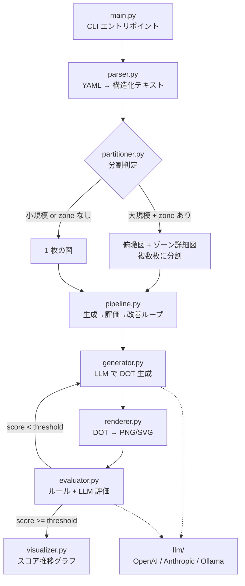

# d2v ソースコード解説

本ドキュメントは `d2v`（Diagram to Vision）のソースコード構成と各モジュールの役割・内部設計を解説します。
プロダクトとしての使い方は [README.md](README.md) を参照してください。

## 全体アーキテクチャ

`d2v` は「YAML トポロジ → LLM で DOT 生成 → 評価 → 改善ループ → 画像化」というパイプラインで構成されます。
中核となるのは **生成 (generator) → 評価 (evaluator) → 改善 (pipeline) のフィードバックループ** で、
評価スコアが閾値に達するまで自律的に図を改善します。



## ディレクトリ構成

```
main.py                     ← CLI エントリポイント（引数解析・進捗表示・分割制御）
src/d2v/
├── __init__.py             ← パッケージ宣言
├── config.py               ← 設定管理（.env / 環境変数）
├── parser.py               ← iida-network-model YAML のパースとテキスト整形
├── partitioner.py          ← 大規模トポロジのゾーン単位分割
├── pipeline.py             ← 生成→評価→改善ループの制御
├── generator.py            ← LLM による DOT コード生成
├── evaluator.py            ← ルールベース + LLM による品質評価
├── renderer.py             ← Graphviz による画像レンダリング
├── visualizer.py           ← スコア推移グラフの描画
└── llm/                    ← LLM プロバイダー抽象化
    ├── __init__.py         ← ファクトリー（get_llm）
    ├── base.py             ← 抽象基底クラス LLMClient
    ├── openai_client.py    ← OpenAI 実装
    ├── anthropic_client.py ← Anthropic 実装
    └── ollama_client.py    ← Ollama（ローカル LLM）実装
prompts/                    ← LLM に渡すシステムプロンプト（生成・評価・改善）
```

## モジュール詳細

### `main.py` — CLI エントリポイント

`argparse` で CLI 引数を解析し、`rich` でリッチな進捗表示を行います。処理の流れは以下の通りです。

1. `parser.load_model()` でトポロジ YAML を読み込み、`parser.build_text()` で構造化テキスト化。
2. `partitioner.plan()` で分割の要否を判定。
3. 分割不要なら `_run_single()`、分割ありなら `_run_split()` を呼び出す。

- `_run_single()`: `pipeline.run()` を 1 回実行し、最終スコアと出力ファイルをサマリー表示。2 回以上イテレーションした場合は `visualizer.plot_score_history()` でスコア推移グラフを生成。
- `_run_split()`: 俯瞰図とゾーン詳細図それぞれについて `pipeline.run()` を実行し、各ベスト画像を出力ルートに集約。全体を表形式のサマリーで表示。

主な CLI オプション: `--input/-i`、`--output-dir/-o`、`--format/-f`、`--max-iter/-n`、`--threshold/-t`、`--patience`、`--split-threshold`、`--no-split`、`--zone-opacity`。

### `config.py` — 設定管理

`pydantic-settings` の `BaseSettings` を用い、`.env` ファイルと環境変数から設定を読み込みます。

- `llm_provider`: `"openai"` / `"anthropic"` / `"ollama"` を選択。
- 各プロバイダーの API キー（`SecretStr` で秘匿）とモデル名。
- `llm_max_tokens`: 生成トークン上限（デフォルト 8192）。大規模トポロジで DOT が途切れないよう十分大きく設定。
- モジュール読み込み時に `settings = Settings()` シングルトンを生成。

### `parser.py` — トポロジのパースとテキスト整形

iida-network-model 形式の YAML を読み込み、LLM プロンプト用の構造化テキストへ変換します。

- `TopologyModel` (dataclass): パース済みトポロジを保持。`devices` / `connections` / `subnets` / `device_map`（device-id → デバイス辞書）を持ち、`zone_of()` でデバイスのゾーン名を取得。
- `load_model()`: YAML を読み込み `TopologyModel` を返す。必須フィールド欠落時は `TopologyParseError` を送出し、分かりやすいエラーで終了。
- `device_lines()`: 1 デバイスをノード一覧テキストへ整形。`only_interfaces` でインターフェースを限定、`external_zone` で「外部ゾーン参照ノード（境界スタブ）」として注記可能（分割詳細図で再利用）。
- `connection_line()`: 1 物理接続を `d0[i0](ip0) <--> d1[i1](ip1)` 形式へ整形。`note` で境界リンク注記を付与可能。
- `build_text()`: ノード一覧・物理接続一覧・L3 サブネット一覧を含む構造化テキストを生成。**見出しに台数・本数を埋め込む**（例: `## ノード一覧（7 台）`）ことで、後段の generator / evaluator が正規表現で期待数を抽出できるようにしている。
- `parse()`: `load_model()` + `build_text()` の便宜ラッパー。

### `partitioner.py` — 大規模トポロジの分割

ノード数がしきい値を超え、かつ `zone` が付与されている場合に、図を「俯瞰図 + ゾーン詳細図」へ分割します。

- `SubDiagram` (dataclass): 分割後の 1 枚を表す。`key`（ファイル名用識別子）/ `title` / `text`（LLM 用テキスト）。
- `should_split()`: 分割条件（`node_count > threshold` かつ `has_zones`）を判定。
- `plan()`: 分割計画を返す。分割不要なら `None`。返り値の先頭が俯瞰図（`key="overview"`）、以降が各ゾーン詳細図。
- `_overview_text()`: ゾーンを 1 まとまりに集約した俯瞰図テキスト。ゾーン間リンクは本数を集約して表示。
- `_detail_text()`: 1 ゾーンの詳細図テキスト。他ゾーンへ跨る接続は「境界スタブ（外部参照ノード）」として含め、各図を自己完結させる。関連 L3 サブネットは `_subnets_for()` でインターフェース IP から自動抽出。

分割により 1 枚あたりのノード数・トークン量を減らし、可読性向上と LLM のレート制限（TPM）緩和の両方に寄与します。

### `pipeline.py` — 生成→評価→改善ループ

パイプラインの中核。1 枚の図について、生成→評価→改善のループを制御します。

- `IterationRecord` (dataclass): 1 イテレーションの記録（DOT・画像パス・評価結果・ベストフラグ）。
- `PipelineResult` (dataclass): 実行全体の結果（ベスト DOT・評価結果・画像・全記録）。
- `run()`: メイン API。1 イテレーションのフローは以下。
  1. `generator.generate()` で DOT 生成（初回はヒントなし、2 回目以降は前回の改善点を渡す）。
  2. `renderer.render()` でレンダリング。`RenderError`（DOT 構文エラー等）は停止せず、エラー内容を次イテレーションの改善ヒントに変換して継続。
  3. `evaluator.evaluate()` で評価。
  4. ベストスコアを更新（下がった場合は直前のベストを保持）。
  5. 終了判定: `passed`（閾値到達）、ベスト非更新が `patience` 回連続（早期終了）、または `max_iterations` 到達。
- `_improve()`: `prompts/diagram-improver.md` を用い、改善点を LLM に渡して修正済み DOT を得る（`generator._extract_dot()` を再利用）。
- `_print_summary()`: イテレーション結果を `rich` のテーブルで表示。
- 全イテレーションでレンダリングに失敗した場合は、有効な図を生成できなかった旨を表示して終了。

### `generator.py` — DOT コード生成

構造化トポロジテキストを LLM に渡し、Graphviz DOT コードを生成します。

- `generate()`: `prompts/diagram-system.md` をシステムプロンプトとして DOT を生成。改善ヒントがあればユーザーメッセージに追記。
- `_completeness_directive()`: 入力テキストからノード数・エッジ数を抽出し、「ちょうど N 個/N 本を定義せよ、省略禁止」という**厳守ディレクティブ**を付与。要約・省略を防ぐ。
- `_extract_dot()`: LLM 応答から DOT を抽出。優先順位は `` ```dot `` ブロック → `digraph` を含むブロック → 汎用コードフェンス → テキスト全体（フォールバック）。
- `_looks_truncated()`: `{` と `}` の数を比較し、DOT が途中で切れているか簡易判定。
- `_continue_generation()`: トークン上限で途切れた場合の救済策。部分コードを提示し「続きのみ」を生成させて連結（最大 `max_rounds` 回）。

### `evaluator.py` — 品質評価

生成した DOT コードを **2 段階（ルールベース + LLM）** で評価します。

- `RuleCheckResult` (Pydantic モデル): ルール検証結果（ノード数・エッジ数の充足、`taillabel` / `headlabel` / `subgraph cluster` / IP ラベルの有無）。
- `EvaluationResult` (Pydantic モデル): 評価結果（`iteration` / `score` / `passed` / `issues` / `rule_checks`）。
- `_run_rule_checks()`: 正規表現で DOT を構造チェック。期待ノード数・エッジ数の 80%（`threshold_ratio`）以上を充足しているかを判定。クォート付きノード名（例 `"inet-rtr-01"`）も数えられるよう配慮。
- `evaluate()`: メイン API。
  1. ルールベース検証を実行。
  2. `prompts/diagram-evaluator.md` で LLM 評価し、JSON から `score`（1〜10）と `issues` を抽出。
  3. ルール違反を `issues` に追記し、スコアに上限ペナルティを適用（ノード/エッジ不足なら最大 5 点、cluster 欠如なら最大 7 点）。
  4. 結果を `eval_iterNN.json` として保存。
- `_parse_llm_json()`: LLM 応答からコードブロック内 JSON を優先的に抽出し、パース失敗時は安全なデフォルト（score=5）を返す。

### `renderer.py` — 画像レンダリング

Graphviz DOT コードを PNG / SVG にレンダリングします。

- `RenderError` (例外): DOT 構文エラーなど、LLM の再生成で回復しうる失敗を表す。保存済み `.dot` パスを保持。
- `apply_zone_opacity()`: DOT 内の `bgcolor="#RRGGBB"` にアルファ値を付与し、ゾーン（cluster）背景を淡くする。Graphviz の `#RRGGBBAA` 形式を利用。`opacity >= 1.0` なら変換不要。
- `render()`: `.dot` ソースを保存してから `graphviz.Source().render()` で画像化。Graphviz 未インストール（`ExecutableNotFound`）は回復不能として即終了、その他の例外は `RenderError` として送出しループでの回復を可能にする。

### `visualizer.py` — スコア推移グラフ

`matplotlib` でイテレーション毎のスコア推移を折れ線グラフとして描画します。

- `plot_score_history()`: スコア推移・合格ライン（点線）・ベストスコアのマーカーを描画し `score_history.png` として保存。ヘッドレス環境対応のため `Agg` バックエンドを使用。`matplotlib` 未インストール時は警告してスキップ。

### `llm/` — LLM プロバイダー抽象化

複数の LLM プロバイダーを共通インターフェースで扱うためのサブパッケージです。

- `base.py`: 抽象基底クラス `LLMClient`。`chat(system, user) -> str` を定義。
- `__init__.py`: ファクトリー `get_llm()`。`settings.llm_provider` に応じて適切なクライアントを生成。API キー欠落時はスタックトレースではなく分かりやすい設定エラーメッセージを表示して終了。
- `openai_client.py`: `OpenAIClient`。`openai` SDK 経由。`max_retries=6` でレート制限時に指数バックオフ自動リトライ。
- `anthropic_client.py`: `AnthropicClient`。`anthropic` SDK 経由。
- `ollama_client.py`: `OllamaClient`。Ollama の OpenAI 互換 API を `openai` SDK 経由で利用（`base_url` に `/v1` を付与）。

新しいプロバイダーを追加する場合は、`LLMClient` を継承して `chat()` を実装し、`get_llm()` に分岐を追加します。

## データフロー（構造化テキストを軸に）

`d2v` の設計の要は、**すべてのモジュール間を「構造化テキスト」で受け渡す**点です。

1. `parser` が YAML を構造化テキスト（見出しに台数・本数を埋め込む）へ変換。
2. `generator` がそのテキストの数値を読み取り「N 個/N 本を厳守」というディレクティブを付加して LLM に渡す。
3. `evaluator` が同じ数値を正規表現で読み取り、DOT の実際のノード/エッジ数と突き合わせて充足を検証。

この「台数・本数をテキストに埋め込む」規約が、生成の完全性チェックと評価のルールベース検証を成立させています。

## 拡張ポイント

| やりたいこと | 変更箇所 |
|-------------|---------|
| 新しい LLM プロバイダーを追加 | `llm/` に `LLMClient` 実装を追加し `get_llm()` に分岐を追加 |
| 生成・評価・改善の指示を調整 | `prompts/*.md` を編集（コード変更不要） |
| 評価のルールを追加・変更 | `evaluator._run_rule_checks()` と `evaluate()` のペナルティロジック |
| 分割ロジックを調整 | `partitioner.plan()` / `_overview_text()` / `_detail_text()` |
| 入力スキーマを拡張 | `parser.load_model()` / `device_lines()` / `connection_line()` |
| 出力の見た目（透過度など） | `renderer.apply_zone_opacity()` / `prompts/diagram-system.md` |
