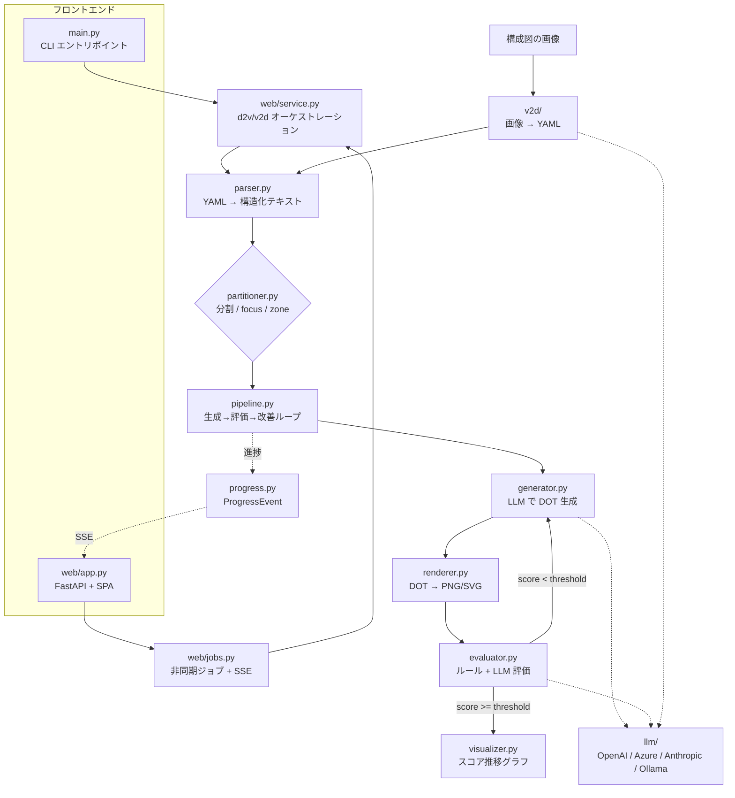

# d2v ソースコード解説

本ドキュメントは `d2v`（Diagram to Vision）のソースコード構成と各モジュールの役割・内部設計を解説します。
プロダクトとしての使い方は [README.md](README.md) を参照してください。

本プロジェクトは 3 つの機能軸で構成されます。

- **d2v（順方向）**: YAML トポロジ → LLM で DOT 生成 → 評価 → 改善ループ → 画像化。
- **v2d（逆方向）**: 構成図の画像 → vision LLM で構造抽出 → iida-network-model YAML 化。
- **Web GUI**: 上記 2 つをブラウザから実行し、進捗を SSE でリアルタイム表示。CLI は後方互換のまま維持。

## 全体アーキテクチャ

中核は **生成 (generator) → 評価 (evaluator) → 改善 (pipeline) のフィードバックループ** で、
評価スコアが閾値に達するまで自律的に図を改善します。CLI と Web GUI は共通の
オーケストレーション層（`web/service.py`）と進捗イベント（`progress.py`）を共有します。



## ディレクトリ構成

```
main.py                     ← CLI エントリポイント（d2v / v2d / serve サブコマンド）
src/d2v/
├── __init__.py             ← パッケージ宣言
├── config.py               ← 設定管理（.env / 環境変数）
├── parser.py               ← iida-network-model YAML のパースとテキスト整形
├── partitioner.py          ← 分割（俯瞰図+詳細）/ focus / zone のサブグラフ生成
├── pipeline.py             ← 生成→評価→改善ループの制御（progress_callback 対応）
├── generator.py            ← LLM による DOT コード生成
├── evaluator.py            ← ルールベース + LLM による品質評価
├── renderer.py             ← Graphviz による画像レンダリング
├── icons.py                ← デバイス種別アイコン（SVG/PNG 生成・HTML ラベル・SVG インライン埋め込み）
├── visualizer.py           ← スコア推移グラフの描画
├── progress.py             ← 進捗イベント定義（CLI / GUI 共通）
├── llm/                    ← LLM プロバイダー抽象化
│   ├── __init__.py         ← ファクトリー（get_llm）
│   ├── base.py             ← 抽象基底クラス LLMClient（chat / chat_with_images）
│   ├── openai_client.py    ← OpenAI 実装
│   ├── azure_openai_client.py ← Azure OpenAI（api-key ヘッダー方式・429 リトライ）
│   ├── anthropic_client.py ← Anthropic 実装
│   └── ollama_client.py    ← Ollama（ローカル LLM）実装
├── v2d/                    ← vision-to-diagram（画像 → YAML）
│   ├── preprocess.py       ← 画像の正規化・データURL化
│   ├── schema.py           ← 中間表現（ExtractedDiagram）
│   ├── extractor.py        ← vision LLM で画像 → 中間表現
│   ├── refine.py           ← 抽出結果の整合性補正
│   ├── converter.py        ← 中間表現 → iida-network-model YAML
│   ├── evaluate.py         ← 抽出精度の計測・d2v 再描画
│   └── pipeline.py         ← 画像 → YAML の一連フロー
└── web/                    ← ブラウザ GUI（FastAPI）
    ├── app.py              ← FastAPI アプリ・ルーティング・成果物配信
    ├── service.py          ← d2v/v2d オーケストレーション（CLI と共通）
    ├── jobs.py             ← 非同期ジョブ管理・SSE 進捗ストリーミング
    ├── events.py           ← ジョブ状態・イベントのシリアライズ
    └── static/             ← SPA（index.html / app.js / style.css）
prompts/                    ← LLM に渡すプロンプト（生成・評価・改善・俯瞰図・v2d 抽出）
tests/                      ← Web API・v2d の単体/回帰テスト（pytest）
```

## モジュール詳細

### `main.py` — CLI エントリポイント

`main()` が `sys.argv[1]` を見てサブコマンドへ振り分けます（後方互換のため既定は従来の d2v）。

- `v2d` → `run_v2d()`（画像 → YAML）
- `serve` → `run_serve()`（FastAPI GUI を uvicorn で起動。既定 `127.0.0.1`）
- それ以外 → `run_d2v()`（従来の YAML → 図）

`run_d2v()` は `argparse` で引数を解析し、`rich` で進捗表示します。中核の分岐ロジック自体は
`web/service.py` に集約されており、`main.py` は**パラメータを組み立てて `service.run_d2v_job()` を
呼ぶ**だけの薄い層です（CLI と GUI でロジックを二重化しないため）。

- `_cli_progress()`: `service` が emit するジョブレベルの進捗イベント（`topology` / `plan` /
  `diagram_start`）を受け取り `rich` の見出しを表示。イテレーション詳細は `pipeline.run()` が
  自身のコンソールへ出力する。
- `_print_job_summary()` / `_print_single_summary()` / `_print_split_summary()`: ジョブ完了後の
  最終サマリー（パネル・テーブル）をモード別に表示。single モードでは
  `visualizer.plot_score_history()` でスコア推移グラフも生成。

主な CLI オプション: `--input/-i`、`--output-dir/-o`、`--format/-f`、`--max-iter/-n`、
`--threshold/-t`、`--patience`、`--split-threshold`、`--no-split`、`--focus`（+`--hops`）、
`--zone`、`--zone-opacity`。`--focus` と `--zone` は排他。

### `config.py` — 設定管理

`pydantic-settings` の `BaseSettings` を用い、`.env` ファイルと環境変数から設定を読み込みます。

- `llm_provider`: `"openai"` / `"azure"` / `"anthropic"` / `"ollama"` を選択。
- 各プロバイダーの API キー（`SecretStr` で秘匿）とモデル名・エンドポイント。
- `llm_max_tokens`: 生成トークン上限（デフォルト 8192）。大規模トポロジで DOT が途切れないよう十分大きく設定。
- `boundary_agg_threshold` / `diagram_aspect_ratio`: 分割詳細図の境界スタブ集約・図の縦横比。
- `v2d_max_image_dim`: vision LLM に渡す画像の最大辺ピクセル。
- モジュール読み込み時に `settings = Settings()` シングルトンを生成。

### `parser.py` — トポロジのパースとテキスト整形

iida-network-model 形式の YAML を読み込み、LLM プロンプト用の構造化テキストへ変換します。

- `TopologyModel` (dataclass): パース済みトポロジを保持。`devices` / `connections` / `subnets` / `device_map`（device-id → デバイス辞書）を持ち、`zone_of()` でデバイスのゾーン名を取得。
- `load_model()`: YAML を読み込み `TopologyModel` を返す。必須フィールド欠落時は `TopologyParseError` を送出し、分かりやすいエラーで終了。
- `device_lines()`: 1 デバイスをノード一覧テキストへ整形。`only_interfaces` でインターフェースを限定、`external_zone` で「外部ゾーン参照ノード（境界スタブ）」として注記可能（分割詳細図で再利用）。
- `connection_line()`: 1 物理接続を `d0[i0](ip0) <--> d1[i1](ip1)` 形式へ整形。`note` で境界リンク注記を付与可能。
- `build_text()`: ノード一覧・物理接続一覧・L3 サブネット一覧を含む構造化テキストを生成。**見出しに台数・本数を埋め込む**（例: `## ノード一覧（7 台）`）ことで、後段の generator / evaluator が正規表現で期待数を抽出できるようにしている。
- `parse()`: `load_model()` + `build_text()` の便宜ラッパー。

### `partitioner.py` — サブグラフ生成（分割 / focus / zone）

大規模トポロジを扱いやすくするため、図を複数の観点でサブグラフへ切り出します。いずれも
LLM 用テキストを表す `SubDiagram` を返し、後段の `pipeline` は 1 枚として扱います。

- `SubDiagram` (dataclass): 生成対象の 1 枚を表す。`key`（ファイル名用識別子）/ `title` / `text`（LLM 用テキスト）。
- `should_split()`: 自動分割条件（`node_count > threshold` かつ `has_zones`）を判定。
- `plan()`: **俯瞰図 + ゾーン詳細図**への自動分割計画を返す（分割不要なら `None`）。先頭が俯瞰図（`key="overview"`）、以降が各ゾーン詳細図。
  - `_overview_text()`: ゾーンを 1 まとまりに集約し、ゾーン間リンクを本数付きで示す俯瞰図テキスト。
  - `_detail_text()`: 1 ゾーンの詳細図。他ゾーンへ跨る接続は「境界スタブ（外部参照ノード）」として含め自己完結させる。関連 L3 サブネットは `_subnets_for()` で自動抽出。
- `focus_plan()`: **注目ノード集中図**。1 台以上の `device-id` を起点に、物理接続を `hops` ホップ辿って到達できるノードだけを抽出（`_build_adjacency()` / `hop_distances()` で BFS）。範囲外へ続く境界ノードには「この先に N 台（省略）」と注記。
- `zone_plan()`: **ゾーン限定図**。指定ゾーンのノードだけを描画対象にし、対象外へ跨る接続は境界スタブとして表示。
- `available_zones()`: トポロジに存在するゾーン名の一覧（バリデーション用）。

分割・限定により 1 枚あたりのノード数・トークン量を減らし、可読性向上と LLM のレート制限（TPM）緩和の両方に寄与します。

### `pipeline.py` — 生成→評価→改善ループ

パイプラインの中核。1 枚の図について、生成→評価→改善のループを制御します。

- `IterationRecord` (dataclass): 1 イテレーションの記録（DOT・画像パス・評価結果・ベストフラグ）。
- `PipelineResult` (dataclass): 実行全体の結果（ベスト DOT・評価結果・画像・全記録）。
- `run()`: メイン API。1 イテレーションのフローは以下。
  1. `generator.generate()` で DOT 生成（初回はヒントなし、2 回目以降は前回の改善点を渡す）。
  2. `renderer.render()` でレンダリング。`RenderError`（DOT 構文エラー等）は停止せず、エラー内容を次イテレーションの改善ヒントに変換して継続。
  3. `evaluator.evaluate()` で評価。
  4. ベストスコアを更新（下がった場合は直前のベストを保持）。
  5. 終了判定: `passed`（閾値到達）、ベスト非更新が `patience` 回連続（早期終了）、または `max_iterations` 到達。
  - **`progress_callback` 引数**（既定 `None`）: 各ステップで `progress.ProgressEvent` を追加的に
    emit する。`None` なら従来どおり `rich` のコンソール表示のみ。Web GUI ではこのコールバック経由で
    SSE に進捗を流す（CLI 表示は維持したまま非破壊で追加）。
- `_improve()`: `prompts/diagram-improver.md` を用い、改善点を LLM に渡して修正済み DOT を得る（`generator._extract_dot()` を再利用）。
- `_print_summary()`: イテレーション結果を `rich` のテーブルで表示。
- 全イテレーションでレンダリングに失敗した場合は、有効な図を生成できなかった旨を表示して終了。

### `generator.py` — DOT コード生成

構造化トポロジテキストを LLM に渡し、Graphviz DOT コードを生成します。

- `generate()`: `prompts/diagram-system.md` をシステムプロンプトとして DOT を生成。改善ヒントがあればユーザーメッセージに追記。
- `_completeness_directive()`: 入力テキストからノード数・エッジ数を抽出し、「ちょうど N 個/N 本を定義せよ、省略禁止」という**厳守ディレクティブ**を付与。要約・省略を防ぐ。
- `_extract_dot()`: LLM 応答から DOT を抽出。優先順位は `` ```dot `` ブロック → `digraph` を含むブロック → 汎用コードフェンス → テキスト全体（フォールバック）。
- `_looks_truncated()`: `{` と `}` の数を比較し、DOT が途中で切れているか簡易判定。
- `_continue_generation()`: トークン上限で途切れた場合の救済策。部分コードを提示し「続きのみ」を生成させて連結（最大 `max_rounds` 回）。

### `evaluator.py` — 品質評価

生成した DOT コードを **2 段階（ルールベース + LLM）** で評価します。

- `RuleCheckResult` (Pydantic モデル): ルール検証結果（ノード数・エッジ数の充足、`taillabel` / `headlabel` / `subgraph cluster` / IP ラベルの有無）。
- `EvaluationResult` (Pydantic モデル): 評価結果（`iteration` / `score` / `passed` / `issues` / `rule_checks`）。
- `_run_rule_checks()`: 正規表現で DOT を構造チェック。期待ノード数・エッジ数の 80%（`threshold_ratio`）以上を充足しているかを判定。クォート付きノード名（例 `"inet-rtr-01"`）も数えられるよう配慮。
- `evaluate()`: メイン API。
  1. ルールベース検証を実行。
  2. `prompts/diagram-evaluator.md` で LLM 評価し、JSON から `score`（1〜10）と `issues` を抽出。
  3. ルール違反を `issues` に追記し、スコアに上限ペナルティを適用（ノード/エッジ不足なら最大 5 点、cluster 欠如なら最大 7 点）。
  4. 結果を `eval_iterNN.json` として保存。
- `_parse_llm_json()`: LLM 応答からコードブロック内 JSON を優先的に抽出し、パース失敗時は安全なデフォルト（score=5）を返す。

### `renderer.py` — 画像レンダリング

Graphviz DOT コードを PNG / SVG にレンダリングします。

- `RenderError` (例外): DOT 構文エラーなど、LLM の再生成で回復しうる失敗を表す。保存済み `.dot` パスを保持。
- `apply_zone_opacity()`: DOT 内の `bgcolor="#RRGGBB"` にアルファ値を付与し、ゾーン（cluster）背景を淡くする。Graphviz の `#RRGGBBAA` 形式を利用。`opacity >= 1.0` なら変換不要。
- `render()`: `.dot` ソースを保存してから `graphviz.Source().render()` で画像化。Graphviz 未インストール（`ExecutableNotFound`）は回復不能として即終了、その他の例外は `RenderError` として送出しループでの回復を可能にする。

### `visualizer.py` — スコア推移グラフ

`matplotlib` でイテレーション毎のスコア推移を折れ線グラフとして描画します。

- `plot_score_history()`: スコア推移・合格ライン（点線）・ベストスコアのマーカーを描画し `score_history.png` として保存。ヘッドレス環境対応のため `Agg` バックエンドを使用。`matplotlib` 未インストール時は警告してスキップ。

### `llm/` — LLM プロバイダー抽象化

複数の LLM プロバイダーを共通インターフェースで扱うためのサブパッケージです。

- `base.py`: 抽象基底クラス `LLMClient`。`chat(system, user) -> str` に加え、画像入力用の
  `chat_with_images(system, user, image_data_urls) -> str`（vision）を定義。
- `__init__.py`: ファクトリー `get_llm()`。`settings.llm_provider` に応じて適切なクライアントを生成。API キー欠落時はスタックトレースではなく分かりやすい設定エラーメッセージを表示して終了。
- `openai_client.py`: `OpenAIClient`。`openai` SDK 経由。レート制限時に指数バックオフ自動リトライ。
- `azure_openai_client.py`: `AzureOpenAIClient`。社内 Azure OpenAI（api-key ヘッダー方式の REST エンドポイント）向け。POST 処理を `_post()` に共通化し `chat` / `chat_with_images` で共有、HTTP 429 の指数バックオフリトライを実装。
- `anthropic_client.py`: `AnthropicClient`。`anthropic` SDK 経由。画像は独自の image ブロック形式で送信。
- `ollama_client.py`: `OllamaClient`。Ollama の OpenAI 互換 API を `openai` SDK 経由で利用（`base_url` に `/v1` を付与）。

`chat_with_images` は OpenAI 互換形式（`content` 配列に `image_url` の base64 データ URL）を基本とし、
v2d の画像解析で使用します。新しいプロバイダーを追加する場合は、`LLMClient` を継承して `chat()` /
`chat_with_images()` を実装し、`get_llm()` に分岐を追加します。

### `progress.py` — 進捗イベント（CLI / GUI 共通）

CLI（`rich` 表示）と Web GUI（SSE 配信）で**同一の進捗イベント源**を共有するための小さな中立モジュール。

- `ProgressEvent` (dataclass): 1 イベント。`stage`（`generate` / `render` / `score` / `diagram_start` など）・`message`・`iteration` / `total`・`score` / `passed` / `is_best`・`extra`。
- `ProgressCallback`: `Callable[[ProgressEvent], None]` の型エイリアス。
- `emit(callback, event)`: コールバックが `None` でなければイベントを渡すヘルパー。

`pipeline.run()` はパイプライン内のイベント、`web/service.py` はジョブレベルのイベント（`topology` /
`plan` / `diagram_start` / `diagram_done` / `job_done`）を emit します。UI 層に依存しないよう標準ライブラリのみを使用。

### `v2d/` — vision-to-diagram（画像 → YAML）

構成図の**画像**から `iida-network-model` YAML を復元する逆方向パイプライン。抽出は
マルチモーダル LLM（vision）を主軸とし、OCR/CV は補助・将来対応に留めています。

- `preprocess.py`: 入力画像の検証（拡張子・存在・破損）と正規化（EXIF 向き補正 → RGB 化 →
  最大辺 `v2d_max_image_dim` での縮小 → base64 データ URL 化）。結果は `PreprocessedImage`。
- `schema.py`: 中間表現を Pydantic で定義。`ExtractedDiagram`（`nodes` / `edges` / `clusters` /
  `notes` / `confidence`）。各要素が `confidence` を保持。
- `extractor.py`: 前処理 → `prompts/v2d-extract.md` を用いた vision LLM 呼び出し → JSON パース →
  `ExtractedDiagram` 検証（`extract_from_image`）。
- `refine.py`: 抽出結果の整合性補正（同一ホスト名マージ・未定義参照の除去・自己ループ/重複エッジ除去・
  クラスタからの zone 補完・孤立ノード検出）。補正内容は `RefineReport` に記録。
- `converter.py`: 中間表現 → iida-network-model 辞書 / YAML（`build_model` / `to_yaml`）。device-id 正規化・
  ポート名合成・エッジ segment の ip-subnet 集約。
- `evaluate.py`: 抽出結果と正解 YAML の一致指標（ノード/エッジ P・R・F1、種別/ゾーン/loopback 一致率）を
  計測（`compare_models` / `evaluate_files`）。`rerender_with_d2v()` で d2v 再描画し往復ループを閉じる。
- `pipeline.py`: 画像 → 抽出 → 補正 → YAML 出力を束ねる `run(image_path, output_dir)`。成果物は
  `<stem>.yaml` と `<stem>.v2d.json`（確信度・所見・補正内容・カウント）。既存 `parser.load_model` で
  再パースし整合を確認。

### `web/` — ブラウザ GUI（FastAPI）

CLI を後方互換のまま維持しつつ、d2v/v2d をブラウザから実行する GUI。バックエンドは FastAPI、
フロントは追加ビルド不要の静的 SPA（Vanilla JS）で、進捗は SSE で配信します。

- `app.py`: FastAPI アプリとルーティング。ジョブ作成（`POST /api/d2v/jobs`・`POST /api/v2d/jobs`）、
  状態取得（`GET /api/jobs/{id}`）、進捗ストリーム（`GET /api/jobs/{id}/events`・SSE）、成果物配信
  （画像 / DOT / 評価 / v2d の YAML・サイドカー・元画像・再描画）を提供。入力検証（サイズ上限・
  拡張子/MIME・パストラバーサル防止）と同時実行上限超過時の 429 を担う。
- `service.py`: **CLI と共通のオーケストレーション層**。`run_d2v_job()`（single/split/focus/zone を
  自動判別し `parser` → `partitioner` → `pipeline.run` を駆動）と `run_v2d_job()`（抽出 → 任意で
  精度計測・再描画）を提供。検証エラーは `D2VJobError` を送出（UI で捕捉）。`D2VParams` /
  `DiagramOutput` / `D2VJobResult` / `V2DJobResult` を定義。
- `jobs.py`: インメモリの `JobRegistry` と `Job`。LLM 呼び出しは同期ブロッキングのため
  `ThreadPoolExecutor` の別スレッドで実行し、進捗は `threading.Condition` + イベントリスト方式で
  SSE ジェネレータへ配信（遅延接続でも全イベントをリプレイ可能・複数接続が独立購読可能）。
  `MAX_ACTIVE_JOBS` で同時実行を制限し、超過時は `JobBusyError`。成果物は `output/webui/<job_id>/` に隔離。
- `events.py`: `JobState`（queued/running/succeeded/failed）と `event_to_dict()`（`ProgressEvent` を
  SSE 用 JSON へ。Path 等を再帰的に str 化）。
- `static/`: SPA 本体。`index.html`（d2v / v2d の 2 タブ・履歴ドロワー）、`app.js`（フォーム制御・
  `EventSource` による SSE 購読・結果描画・履歴/共有リンク/v2d→d2v 連携）、`style.css`。

進捗のリアルタイム表示は「`pipeline`/`service` が `ProgressEvent` を emit → `Job.add_event` が
`Condition` で通知 → SSE ジェネレータが `yield` → ブラウザの `EventSource` が受信」という流れです。

## データフロー（構造化テキストを軸に）

`d2v` の設計の要は、**すべてのモジュール間を「構造化テキスト」で受け渡す**点です。

1. `parser` が YAML を構造化テキスト（見出しに台数・本数を埋め込む）へ変換。
2. `generator` がそのテキストの数値を読み取り「N 個/N 本を厳守」というディレクティブを付加して LLM に渡す。
3. `evaluator` が同じ数値を正規表現で読み取り、DOT の実際のノード/エッジ数と突き合わせて充足を検証。

この「台数・本数をテキストに埋め込む」規約が、生成の完全性チェックと評価のルールベース検証を成立させています。

## 拡張ポイント

| やりたいこと | 変更箇所 |
|-------------|---------|
| 新しい LLM プロバイダーを追加 | `llm/` に `LLMClient` 実装（`chat` / `chat_with_images`）を追加し `get_llm()` に分岐を追加 |
| 生成・評価・改善の指示を調整 | `prompts/*.md` を編集（コード変更不要） |
| 評価のルールを追加・変更 | `evaluator._run_rule_checks()` と `evaluate()` のペナルティロジック |
| 分割 / focus / zone ロジックを調整 | `partitioner.plan()` / `focus_plan()` / `zone_plan()` / `_overview_text()` / `_detail_text()` |
| 入力スキーマを拡張 | `parser.load_model()` / `device_lines()` / `connection_line()` |
| 出力の見た目（透過度など） | `renderer.apply_zone_opacity()` / `prompts/diagram-system.md` |
| CLI と GUI 共通の生成フローを変更 | `web/service.py`（`run_d2v_job` / `run_v2d_job`）— CLI・GUI 双方に反映される |
| 進捗イベントの種類を追加 | `progress.ProgressEvent` の `stage` を追加し、`pipeline` / `service` で emit、フロントの `app.js` でハンドラ追加 |
| GUI の画面・API を変更 | `web/app.py`（ルーティング・検証）/ `web/static/`（SPA） |
| v2d の抽出・変換を調整 | `prompts/v2d-extract.md` / `v2d/extractor.py` / `v2d/refine.py` / `v2d/converter.py` |

## テスト

`tests/` に `pytest` ベースのテストを配置しています（LLM を使わない決定論部分を網羅）。

- `test_v2d_converter.py` / `test_v2d_refine.py` / `test_v2d_evaluate.py` / `test_v2d_preprocess_extract.py`:
  v2d の中間表現・変換・補正・精度計測・前処理/抽出（LLM はモック）。
- `test_web_api.py`: Web API を FastAPI `TestClient` で検証。ジョブ作成・状態遷移・成果物取得・
  不正入力拒否（パストラバーサル・サイズ超過・不正 MIME 等）。`service` 層をフェイクへ差し替え LLM 不要。
